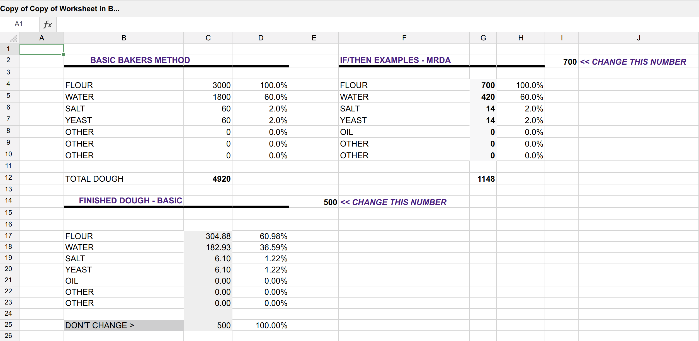

# Bread Ahead

#### A bakers percentage calculator breadsite.

As a avid baker, there was a need for an easy to use and accessible bread calculation tool that made it easy to adjust and keep record of bread formulas.

#### Inspiration:

   The below image is inspiration for creation which can be found at found at: (**Note**: follow link at bottom to access the spreadsheet) <http://www.theartisan.net/Spreadsheet.htm> 

#### Features:
1. Have a static 1000g/100% baker formula.
1. Using the static formula give exact desired loaf size(dough).
1. Using exact loaves as a base multiplier for multiple loaves
1. Using a flour total calculate other ingredients needed utilizing basic formula. 

##### To be added:
   * Measurement conversion out of grams.
   * Dynamic forms to add custom ingredients or split one field to contain more than one type of ingredient (flour field can be split to contain White flour and Rye or add a new custom field like Oil or Milk). 
   * Levain calculations for more precise formulas (hydration, flour types, ect. ).
   * Info button to clarify each fields use and how to use it.
   * Email formula for records containing a link that will repopulate site form for easily changing a formula.  
   * Export as custom file times if desired(e.g. csv, json) with an import to repopulate.
